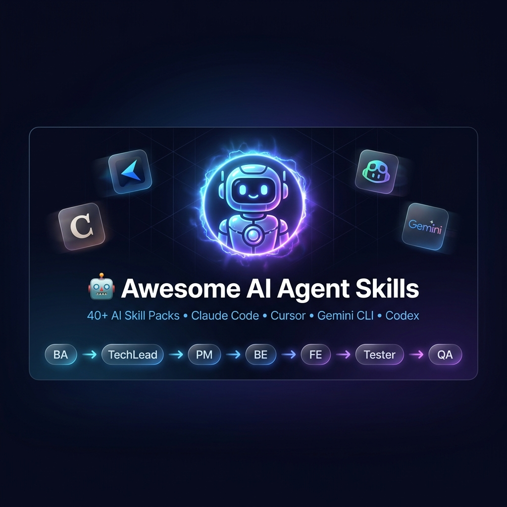

# 🤖 Awesome AI Agent Skills

<div align="center">




**40+ production-ready AI skill packs for Claude Code, Cursor, Codex, Gemini CLI & any LLM agent**

[](https://opensource.org/licenses/MIT)
[](https://github.com/huuanh20/awesome-ai-agent-skills/stargazers)
[](https://huuanh20.github.io/awesome-ai-agent-skills)
[](https://claude.ai)
[](https://cursor.sh)
[](https://ai.google.dev)
[](https://github.com/huuanh20/awesome-ai-agent-skills/blob/main/CONTRIBUTING.md)
[](https://github.com/huuanh20/awesome-ai-agent-skills)

*Stop writing the same prompts over and over. Use battle-tested AI agent skills that simulate a real software development team.*

[📦 Get Started](#-quick-start) · [📖 Skills Overview](#-skills-overview) · [🤝 Contributing](#-contributing)

<br/>

🌍 **Translate this page:**
[🇻🇳 Tiếng Việt](https://translate.google.com/translate?sl=en&tl=vi&u=https://github.com/huuanh20/awesome-ai-agent-skills) ·
[🇨🇳 中文](https://translate.google.com/translate?sl=en&tl=zh-CN&u=https://github.com/huuanh20/awesome-ai-agent-skills) ·
[🇯🇵 日本語](https://translate.google.com/translate?sl=en&tl=ja&u=https://github.com/huuanh20/awesome-ai-agent-skills) ·
[🇰🇷 한국어](https://translate.google.com/translate?sl=en&tl=ko&u=https://github.com/huuanh20/awesome-ai-agent-skills) ·
[🇪🇸 Español](https://translate.google.com/translate?sl=en&tl=es&u=https://github.com/huuanh20/awesome-ai-agent-skills) ·
[🇫🇷 Français](https://translate.google.com/translate?sl=en&tl=fr&u=https://github.com/huuanh20/awesome-ai-agent-skills) ·
[🇩🇪 Deutsch](https://translate.google.com/translate?sl=en&tl=de&u=https://github.com/huuanh20/awesome-ai-agent-skills) ·
[🇧🇷 Português](https://translate.google.com/translate?sl=en&tl=pt&u=https://github.com/huuanh20/awesome-ai-agent-skills) ·
[🇷🇺 Русский](https://translate.google.com/translate?sl=en&tl=ru&u=https://github.com/huuanh20/awesome-ai-agent-skills) ·
[🇸🇦 العربية](https://translate.google.com/translate?sl=en&tl=ar&u=https://github.com/huuanh20/awesome-ai-agent-skills) ·
[🌐 More languages →](https://translate.google.com/translate?sl=en&u=https://github.com/huuanh20/awesome-ai-agent-skills)

</div>

---

## ✨ What is this?

**Awesome AI Agent Skills** is a curated collection of **40 individually documented skill packs** for AI coding agents. It lets your AI agent behave like a complete software development team — from Business Analyst to QA/QC — with a single command.

> 💡 Think of it as **"prompt engineering, done right"** — structured, reusable, composable workflows for any AI agent.

### 🎯 Who is this for?

- 👨‍💻 **Developers** using Cursor, Claude Code, Copilot, or Gemini CLI
- 🏗️ **Teams** that want AI to follow a structured, professional development workflow
- 🚀 **Solo founders & indie hackers** who want a full dev team in their AI agent
- 🎓 **Students** learning software engineering through AI simulation

---

## 🗂️ Skills Overview

Three packs — use independently or chain them into a full end-to-end pipeline.

| Pack | Best For | Commands | Docs |
|---|---|---|---|
| 🛠️ **Development Skills** | Plan → Code → Debug → Test → Review | `/plan` `/cook` `/fix` `/test` `/quality` `/review` | [Open →](./development-skills/README.md) |
| 📋 **SRS Skills** | Turn any idea into a validated IEEE 830-1998 SRS | `/cl:srs` `/cl:srs-flow` | [VI](./srs-skills/README.md) · [EN](./srs-skills/README.en.md) |
| 👥 **Virtual Team Skill** | Simulate a 7-role AI dev team (BA → TechLead → PM → BE → FE → Tester → QA/QC) | `/team "..." --level {level}` | [VI](./virtual-team-skill/README.vi.md) · [EN](./virtual-team-skill/README.md) |

---

## ⚡ Quick Start

### Cursor (Auto-discovery)

Just clone into your project root — Cursor auto-discovers **34 skills** from `.cursor/skills/`:

```bash
git clone https://github.com/huuanh20/awesome-ai-agent-skills.git awesome-ai-agent-skills
cp -r awesome-ai-agent-skills/.cursor .cursor
```

Then in Cursor Agent chat:

```
/plan      → Generate a detailed implementation plan
/cook      → Implement the plan step by step
/fix       → Debug and fix issues
/test      → Write and run tests
/quality   → Code quality review
/review    → Full code review
/srs       → Generate SRS from your idea
```

### Claude Code

```bash
cp -r awesome-ai-agent-skills/.claude .claude
```

### Gemini CLI / Antigravity

```bash
cp -r awesome-ai-agent-skills/.agents .agents
```

### Codex

```bash
cp -r awesome-ai-agent-skills/.codex .codex
```

---

## 🔄 Recommended Workflow

Chain all three packs for a complete software delivery pipeline:

```
💡 Your Idea
   │
   ▼
📋 SRS Skills          /cl:srs-flow
   → Requirements, user stories, acceptance criteria
   │
   ▼
👥 Virtual Team        /team "..." --level mid
   → BA → TechLead → PM → BE Dev → FE Dev → Tester → QA/QC
   → Architecture, design, task breakdown, implementation, QA sign-off
   │
   ▼
🛠️ Development Skills  /plan → /cook → /fix → /test → /quality → /review
   → Clean code, passing tests, reviewed & production-ready
```

---

## 📦 Pack Details

### 🛠️ Development Skills

A complete development lifecycle toolkit. Each skill is a focused, battle-tested prompt:

| Skill | What it does |
|---|---|
| `/plan` | Breaks down a feature into detailed, actionable tasks |
| `/cook` | Implements the plan with clean, production-quality code |
| `/fix` | Diagnoses and resolves bugs with root cause analysis |
| `/test` | Generates comprehensive unit, integration & e2e tests |
| `/quality` | Runs code quality checks, suggests improvements |
| `/review` | Full code review with severity ratings |

→ [Full documentation](./development-skills/README.md)

---

### 📋 SRS Skills

Generates a complete **IEEE 830-1998 Software Requirements Specification** from a raw idea through a 7-step automated pipeline with validation.

| Command | Description |
|---|---|
| `/cl:srs` | Quick SRS from existing requirements text |
| `/cl:srs-flow` | Full pipeline: brainstorm → spec → plan → generate → validate → improve → save |

Compatible with **Claude Code, Gemini CLI, GitHub Copilot**, and any markdown-capable LLM.

→ [Vietnamese guide](./srs-skills/README.md) · [English guide](./srs-skills/README.en.md)

---

### 👥 Virtual Team Skill

Simulates a full software development team of **7 specialized AI roles**, producing all artifacts from requirements to release sign-off.

```
BA → TechLead → PM → BE Dev → FE Dev → Tester → QA/QC
```

| Command | Description |
|---|---|
| `/team "feature description" --level mid` | Run the full 7-agent pipeline |
| `/team-ba` | Business Analyst only |
| `/team-techlead` | Tech Lead only |
| `/team-pm` | Project Manager only |
| `/team-be` | Backend Developer only |
| `/team-fe` | Frontend Developer only |
| `/team-tester` | Tester only |
| `/team-qa` | QA/QC only |

**Experience levels** via `--level`: `fresh` · `junior` · `mid` · `senior`

→ [Vietnamese guide](./virtual-team-skill/README.vi.md) · [English guide](./virtual-team-skill/README.md)

---

## 🤝 Contributing

Contributions are welcome! If you have a useful AI skill or workflow prompt:

1. Fork the repository
2. Add your skill with proper documentation
3. Submit a Pull Request

---

## ⭐ Show Your Support

If this project helps you, please **give it a star** ⭐ — it helps others discover it!

---

## 📄 License

MIT © [huuanh20](https://github.com/huuanh20)

---

<div align="center">

**Made with ❤️ for the AI coding community**

*Claude Code · Cursor · GitHub Copilot · Gemini CLI · Codex*

</div>
